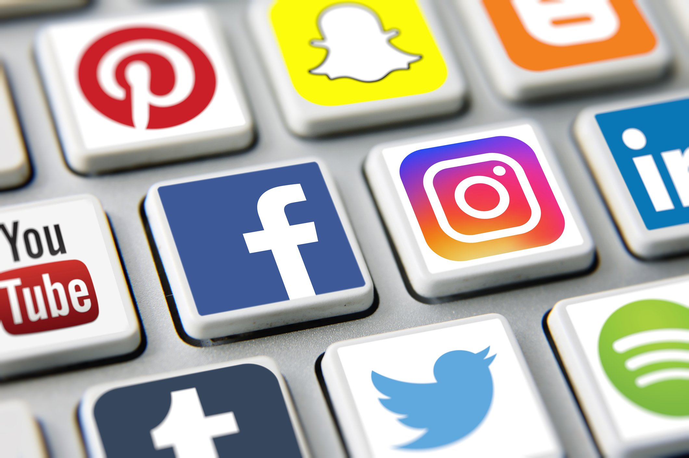
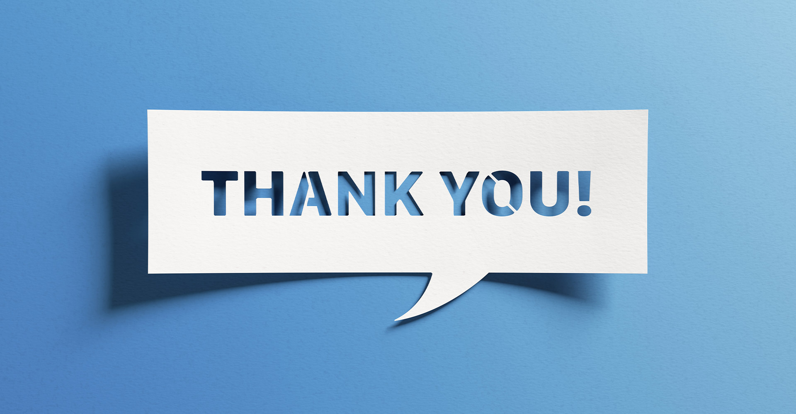

# Student Social Media Addiction

_ _ _

## 📊 Project Overview 

1. This portfolio showcases a comprehensive data analysis project exploring the relationship between social media usage and its potential impact on students well-being. Using a dataset focused on students average daily usage, academic levels, and mental health indicators, I applied key data analysis techniques including exploratory data analysis (EDA), statistical summaries, and visualizations. The goal of this project is to uncover patterns and correlations that can help understand how social media habits may influence students mental health and academic performance. This project demonstrates my ability to handle real-world data, derive insights, and communicate findings effectively.

2. The dataset used in this project was obtained from a publicly available source designed for academic and research purposes. It contains responses from students regarding their average daily time spent on social media, academic level, and self-reported mental health scores. The dataset was curated to support studies exploring behavioral patterns and the psychological effects of digital habits among students.

## 📲 Problem Statement

1. With the growing use of social media among students, there is increasing concern about its potential effects on mental health and academic performance. This project aims to analyze students social media usage patterns and categorize users into low, moderate, and high usage groups. By exploring how these categories correlate with mental health scores, the project seeks to uncover insights that can help educators, parents, and students better understand the impact of social media.
   
2. The goal is to use data-driven analysis to identify trends, detect potential risks, and provide a foundation for informed decision-making regarding healthy digital habits.

## 🎯 Objectives

1. Objective of this project was to analyze the patterns, behaviors, and consequences of social media usage among students. Specifically, the project aimed to:

- Identify the average daily time students spend on social media platforms.

- Categorize students based on their usage levels (Low, Moderate, High).

- Explore the relationship between social media usage and academic performance.

- Uncover correlations between social media addiction and mental health indicators, such as stress levels, anxiety, or sleep quality.

- Provide actionable insights and recommendations to educators, parents, and students to promote healthier digital habits and time management.

## 📥 Data Collection

The dataset included variables such as:

- Daily hours spent on social media

- Most used platforms

- Academic performance 

- Mental health indicators 

- Data was collected in formats like Excel and CSV for ease of import into analysis tools.

## 🛠️ Tools Used

To conduct this analysis effectively, the following tools and technologies were used:

📊 Excel

- Created pivot tables to summarize key metrics such as average social media usage by academic level and mental health category

- Built dynamic dashboards using charts and slicers to visualize trends in usage patterns and students well-being

- Applied business intelligence storytelling techniques to present insights through interactive dashboards and clear reports

🧮 SQL

- Wrote SQL queries to extract and filter data from the student_social_media_addiction table

- Performed aggregations to calculate average daily usage, mental health scores, and usage distribution by academic level

- Used GROUP BY, ORDER BY, CASE WHEN, CTEs, and subqueries for in-depth behavioral analysis

- Identified trends in social media usage by time of day, academic level, and usage category (Low, Moderate, High)

📊 Power BI

- Developed interactive Power BI dashboards to present deeper insights, enabling easy exploration of social media addiction patterns across different student groups

- Used business intelligence storytelling techniques in Power BI to communicate findings effectively through visual reports and interactive elements

## ✅📊 Conclusion 

This project successfully demonstrated how data analysis can uncover meaningful insights into student social media addiction and its effects on mental health. By categorizing usage levels and exploring their correlations with well-being, the analysis highlighted important trends and risk factors. These findings provide a valuable foundation for educators and stakeholders to develop targeted interventions and promote healthier social media habits among students. Overall, the project showcases the power of data-driven approaches in addressing real-world challenges.

## 💡📌 Recommendations 

Raise Awareness: Implement educational programs to inform students about the risks of excessive social media use and its impact on mental health.

Monitor Usage: Encourage regular monitoring of daily social media time to help students maintain balanced digital habits.

Support Systems: Provide counseling and support services for students identified as high-risk users.

Promote Healthy Alternatives: Encourage participation in offline activities such as sports, clubs, and social events to reduce screen time.

Further Research: Conduct longitudinal studies to track changes in social media usage and mental health over time for more comprehensive insights.

Policy Development: Schools and institutions should develop clear guidelines on social media use during school hours to minimize distractions and promote focus.

# Business Questions

## 🧮 1. Descriptive Statistics

 1. What is the average daily social media usage by academic level
 2. What is the average mental health score by gender
 3. Count how many students use each social media platform most frequently
 4. What’s the average addiction score for students who report that social media affects their academic performance

## 📊 2. Behavioral Insights

 5. What is the correlation between average daily usage and mental health score? (Use Python visualization for this, SQL for data prep)
 6. What is the average sleep hours for students addicted (score > 7) to social media vs those not addicted
 7. How does relationship status influence conflicts over social media

## 🌍 3. Demographic Breakdown

 8. Which country has the highest average addiction score
 9. Show the average mental health score by country and gender
 10. Count of students from each academic level by country

## ⚖️ 4. Impact Analysis

 11. Compare average academic-affecting users vs non-affecting in terms of:

- Sleep hours
- Usage hours
- Addiction score
  
 12. For each academic level, find the percentage of students who said social media affects their academics.

## 🧠 5. Advanced SQL (Window Functions / Ranking)

 13. Rank students within their academic level by addiction score
 14. For each country, find the student with the highest daily usage
 15. Use a window function to calculate the average addiction score within each academic level

## 📈 6. Custom Segmentation

 16. Categorize students into "Low", "Moderate", and "High" social media users based on Avg_Daily_Usage_Hours:

- Low: < 3 hrs
- Moderate: 3–6 hrs
- High: > 6 hrs
- Then show how these categories correlate with mental health scores.

## 📋 7. Hypothetical Dashboards

You can simulate or actually build a dashboard in Looker Studio, Tableau, or Power BI using SQL as backend.
Metrics to visualize:

- Usage hours by platform
- Sleep vs addiction score scatter plot
- Platform usage by gender
- Academic performance vs addiction levels

[View More SQL Queries here](Students_Social_Media_Addiction.sql)

# Thank you!

